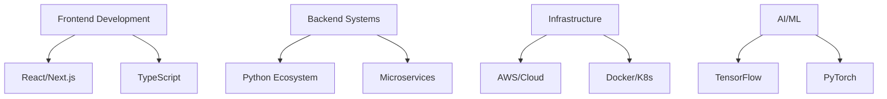

<div align="center">
  
</div>

<div align="center">

# Harivdan Narayanshastri

[](https://git.io/typing-svg)

</div>

<div align="center">
  
[](https://linkedin.com/in/harivdann)
[](mailto:harryshastri21@gmail.com)
[](https://yourportfolio.com)
  

</div>

---

## 🎯 Professional Overview

`Software Engineering Lead` specializing in enterprise-scale solutions with deep expertise in:
- Machine Learning & AI Systems Architecture
- Cloud-Native Development & DevOps
- IoT Solutions & Embedded Systems
- Full-Stack Enterprise Applications

## 💼 Technical Architecture



## 🛠️ Technology Stack

<details>
<summary><b>Development & Architecture</b></summary>

```yaml
Languages:
  Primary: [Python, Java, JavaScript/TypeScript]
  Secondary: [C++, GoLang, SQL]

Frameworks:
  Backend: [Django, FastAPI, Spring Boot]
  Frontend: [React, Next.js, Vue.js]
  ML/AI: [TensorFlow, PyTorch, Scikit-learn]

Infrastructure:
  Cloud: [AWS, GCP, Azure]
  Containers: [Docker, Kubernetes]
  CI/CD: [Jenkins, GitLab CI, GitHub Actions]
```
</details>

<details>
<summary><b>Specialized Tools & Platforms</b></summary>

```yaml
Databases:
  SQL: [PostgreSQL, MySQL]
  NoSQL: [MongoDB, Cassandra]
  Cache: [Redis, Memcached]

Analytics:
  Tools: [Elasticsearch, Kibana]
  Streaming: [Kafka, RabbitMQ]
  Monitoring: [Prometheus, Grafana]
```
</details>

## 📊 Engineering Metrics

<div align="center">
  
  
</div>

## 🎓 Certifications & Expertise

```typescript
const certifications = {
    aws: ['Solutions Architect Professional', 'DevOps Engineer Professional'],
    google: ['Professional Cloud Architect', 'Professional Data Engineer'],
    microsoft: ['Azure Solutions Architect', 'Azure AI Engineer'],
    specializations: ['Machine Learning', 'Cloud Architecture', 'Enterprise Solutions']
}
```

## 🌟 Key Projects & Contributions

<details>
<summary><b>Enterprise Solutions</b></summary>

- **AI-Powered Analytics Platform**
  - Architected scalable ML pipeline processing 10M+ daily transactions
  - Reduced inference time by 60% through optimization
  
- **IoT Fleet Management System**
  - Designed real-time monitoring system for 50K+ devices
  - Implemented predictive maintenance saving $2M annually
</details>

## 📫 Professional Contact

```python
contact_info = {
    "email": "harryshastri21@gmail.com",
    "linkedin": "linkedin.com/in/harivdann",
    "phone": "+91 9130532666",
    "location": "Available for Global Remote Opportunities"
}
```

<div align="center">

---

### "Architecting Tomorrow's Technology Today"

<sub>Open to collaboration on innovative projects and technical leadership roles</sub>

</div>
